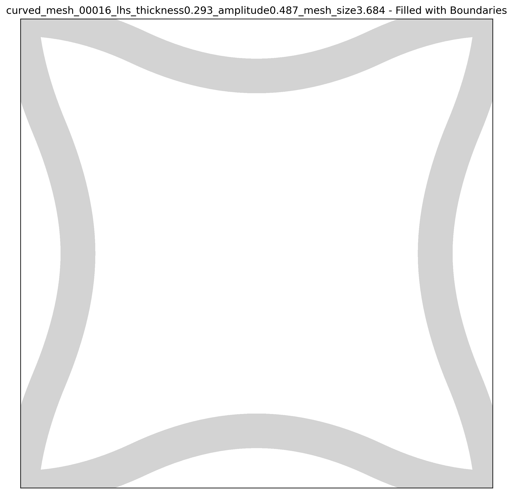
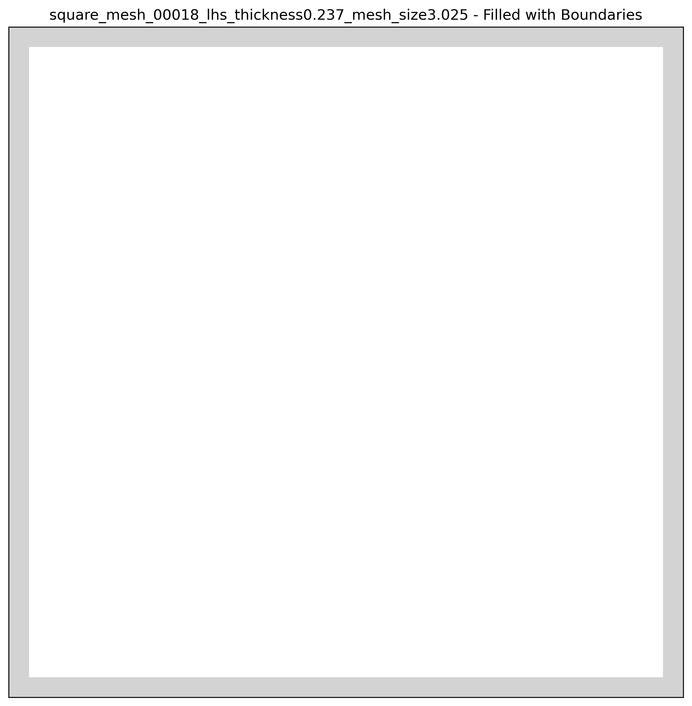
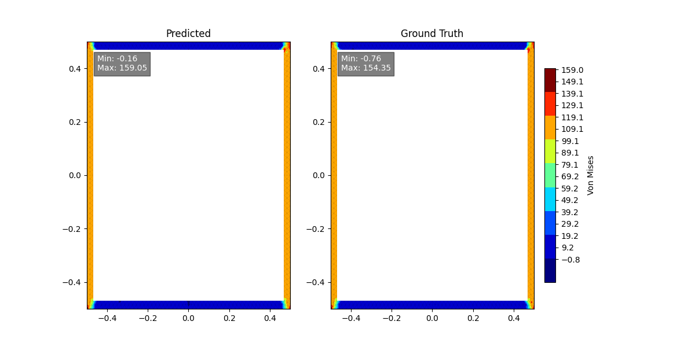

# PyTorch Implementation of MeshGraphNets for Time-Independent Problems
This repository provides a **PyTorch** implementation of **MeshGraphNets** [[1]](#1), adapted for stationary-problem. MeshGraphNets was designed for learning time-dependent mesh-based simulations using Graph Neural Networks (GNNs).

## Challenges in Sationary Problems
Unlike transient problems characterized by a local information propagation over time, stationary problems must directly consider the interactions between distant features. A natural approach for capturing long-range interactions with GNNs is to increase the number of message-passing layers. However, this method is both computationally expensive and prone to oversmoothing [[2]](#2)[[3]](#3).

## Modifications for Stationary Problems
The standard MeshGraphNet is modified as follows:
1. **Edge Augmentation**: New edges are added between randomly-selected node pairs, reducing data propagation locality, as explained in [[2]](#2).
2. **Rotation/Shift Invariant Node Coordinates**: The node coordinates are transformed to a rotation- and shift-invariant coordinate system and included as node attributes, as explained in [[2]](#2).

# Quick Start

1. Install the requirements
```bash
pip install -r requirements.txt
```

2. Edit the config file `config.json`. Available parameters:

```json
{
    # Training device (cuda/cpu)
    "device": "cuda",
    
    # Dataset configuration
    "dataset_path": "davide-d/simple_lattice_cell_samples_2d",
    "training_groups": [                # Groups used for training
      "circles",
      "cubic_chiral",
      "curved",
      "curved_diamond",
      "curved_plus",
      "diamond",
      "square",
      "squared_diamond"
    ],
    "extra_groups": [                   # Groups for additional evaluation
      "hinge",
      "cubic_chiral_thick"
    ],
    "train_test_val_split": [0.6, 0.2, 0.2],  # Dataset split ratios
  
    # Data processing parameters
    "edge_augmentation": 0.2,           # Ratio of random edges to add
    "simulation_coords": true,          # Use rotation/shift-invariant coordinates
  
    # Training parameters
    "num_epochs": 5000,                 # Total training epochs
    "loss": "mse",                      # Loss function (mse/l1)
    "batch_size": 1,                    # Graphs per batch
    "initial_lr": 1e-4,                 # Initial learning rate
    "decay_steps": 125,                 # Steps between LR decay
    "decay_rate": 0.1,                  # LR decay factor
    "min_lr": 1e-6,                     # Minimum learning rate
  
    # Model architecture
    "latent_size": 128,                 # Size of hidden layers
    "dropout_rate": 0.005,              # Dropout probability
    "num_message_passing_steps": 15,    # Number of message passing iterations
  
    # Output paths
    "log_folder": "run/log",            # TensorBoard log directory
    "dataset_save_path": "run/cached_dataset.pt",
    "checkpoint_save_path": "run/checkpoint.pt",
    "checkpoint_freq": 1                # Save checkpoint every N epochs
}
```

3. Run training
```bash
python src/train.py config.json
```

4. Evaluate the results
```bash
python src/eval.py \
    --dataset-path run/cached_dataset.pt \
    --checkpoint-path run/checkpoint.pt \
    --device cuda \
    --extra-datasets extra_datasets.json
```

The evaluation script accepts these arguments:
- Required:
  - `--dataset-path`: Path to the cached dataset file
  - `--checkpoint-path`: Path to the model checkpoint file
- Optional:
  - `--device`: "cuda" or "cpu" (defaults to "cuda" if available)
  - `--extra-datasets`: JSON file for additional dataset evaluation

Example extra_datasets.json:
```json
[
    {
        "name": "Out-of-range group",
        "path": "davide-d/simple_lattice_cell_samples_2d",
        "group": "cubic_chiral_thick"
    },
    {
        "name": "Unseen group",
        "path": "davide-d/simple_lattice_cell_samples_2d",
        "group": "hinge"
    }
]
```

# Synthetic Dataset
A synthtetic dataset is composed of 2D parametric lattice unit-cells simulated under mechanical deformation.

## Process
1. Generate geometries through parameter sampling
2. Mesh using Gmsh [[4]](#4)
3. Simulate the designs with FEniCS [[5]](#5) (linear-elastic simulations under fixed boundary conditions)
4. Compose the dataset with geometries and simulation results


## Design Parameters
| Parameter         | Sampling Range | Description                                    |
|-------------------|----------------|------------------------------------------------|
| `thickness`       | [0.1, 0.3]     | Lattice thickness             |
| `mesh_density_factor` | [3, 4]         | Controls mesh density ( `mesh characteristic length = thickness / mesh_density_factor`)     |
| `curvature` | [0.35, 0.65] | Affects the curvature of the structural elements (when applicable)| 

## Parametric Groups
8 groups of exemplary 2D parametric lattice unit cells

| Circles | Cubic Chiral | Curved | Curved + Diamond |
|:-------:|:------------:|:------:|:----------------:|
|  |  |  |  |
| Additional parameter:<br>`amplitude` [0.35, 0.65] | Additional parameter:<br>`amplitude` [0.35, 0.65] | Additional parameter:<br>`amplitude` [0.35, 0.65] | Additional parameter:<br>`amplitude` [0.35, 0.65] |

| Curved + Plus | Diamond | Square | Square + Diamond |
|:-------------:|:-------:|:------:|:----------------:|
|  |  |  |  |
| Additional parameter:<br>`amplitude` [0.35, 0.65] | No additional parameters | No additional parameters | No additional parameters |

## Parameter Sampling
* Parameter sampling method: Latin Hypercube Sampling (LHS)
* Sample size: 300 data points per group

### Material Properties and Simulation Setup
- Linear elastic uniform material (Young's modulus`E = 1e3`, Poisson's ratio `ν = 0.3`)
- Lagrange elements (polynomial degree `p = 2`)
- Fixed boundary conditions (bottom nodes fixed, top nodes with `-0.1` displacement in y-direction)

## Graph Representation for GNN-Compatible Data

The simulation data is translated into a graph:

### Node attributes
* Node type (1-hot encoding: fixed, displaced, free)
* Node coordinates (2D numerical, rotation and shift invariant)
### Edge Attributes
* Cartesian distance between connected nodes (1D numerical)
* Difference between connected nodes (2D numerical)
* Edge type (categorical): augmented or not-augmented edge

The graph edges are augmented by adding new edges between randomly-selected node pairs. The augumentation procedure increases the number of edges by `20%`.

### Dataset Processing
* Split each parametric group: 60% training, 20% validation, 20% test
* Compile final training, validation, and test sets by combining the training, validation and tests split of each parametric group, respectively.
* Standardize features based on final training-set statistics (Von-Mises stress, node and edge attributes)
    
## Model Architecture
The model follows the MeshGraphNets [[1]](#1) architecture, consisting of 15 convolutional graph blocks with a latent size of 128, and is enriched by dropout regularization layers placed after the encoding block and between each convolutional block to avoid overfitting.

## Training
* Single GPU
* 1000 epochs
* Adam optimizer
* Initial learning rate: 1e-4, exponential decay to 1e-6 in 125 steps
* Batch size: `1`
* MSE loss function


A further metric is the mean relative error in the peak (destandardized) von Mises stress


# Results
* Mean relative error of peak von Mises stress (mean over all test-set simulations): `8.0%` (test set)
* `58.5%` of simulations have an error below `5%` (test set) 
* `72.7%` of simulations have an error below `10%` (test set) 
* `88.8%` of simulations have an error below `20%` (test set) 


## Von Mises prediction examples





## Outlier example
The highest relative error (`78.4%`) for the peak von Mises stress in the test set is obtained for the following example


## Out-of-distribution parameter
The cubic chiral parametric group has been resampled with an out-of-distribution thickness in the interval `[0.6, 0.65]` out of the original interval `[0.1, 0.3]` used during training.

* Mean relative error of peak von Mises stress: `36.0%` (mean over all simulations on cubic chiral dataset with out-of-distribution thickness)


# Limitations
* Fixed boundary conditions, material properties, and geometry bounding box
* Model learns the FEM discretization error

## Unseen group
The model performs poorly on unseen cell group that were not included in the training set. For example a **hinge** cell was NOT included in the training set
* Mean relative error of peak von Mises stress: `639%` (mean over all simulations on unseen data group)


# Citations
<a id="1">[1]</a> Pfaff, Tobias, et al. "Learning mesh-based simulation with graph networks." arXiv preprint arXiv:2010.03409 (2020).

<a id="2">[2]</a> Gladstone, Rini Jasmine, et al. "Mesh-based GNN surrogates for time-independent PDEs." Scientific reports 14.1 (2024): 3394.

<a id="3">[3]</a> Rusch, T. Konstantin, Michael M. Bronstein, and Siddhartha Mishra. "A survey on oversmoothing in graph neural networks." arXiv preprint arXiv:2303.10993 (2023).

<a id="4">[4]</a> https://gmsh.info/

<a id="5">[5]</a> https://fenicsproject.org/